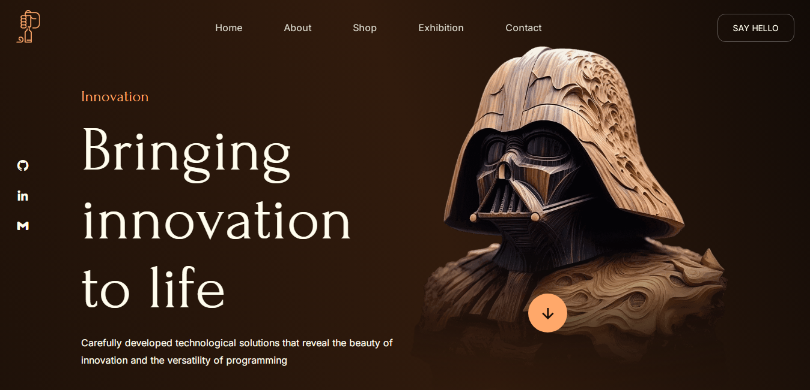

# 🌌 Star Wars 

Este projeto é um site responsivo dedicado aos amantes de **Star Wars**, trazendo uma experiência imersiva para explorar o universo dessa franquia.

  
*Acesse o site clicando [aqui](https://star-wars-puce-omega.vercel.app/).*

## Funcionalidades

- **Layout Responsivo**: O site se adapta a diferentes tamanhos de tela (desktop, tablet e mobile).
- **Seções Temáticas**: Contém seções sobre personagens, naves, filmes e muito mais.
- **Efeitos de Animação**: Utiliza animações CSS para uma navegação mais agradável e dinâmica.
- **Interatividade com JavaScript**: Inclui funcionalidades como menus dinâmicos, modais e galeria de imagens.

## Tecnologias Utilizadas

- **HTML**
- **CSS**
  - Flexbox e Grid Layout para responsividade
  - Animações e transições
- **JavaScript**
  - Eventos e interatividade
  - Efeitos de rolagem e animação

## Como Rodar o Projeto

1. Clone este repositório:
   ```bash
   git clone https://github.com/caioamaral-io/Web-Site.git
